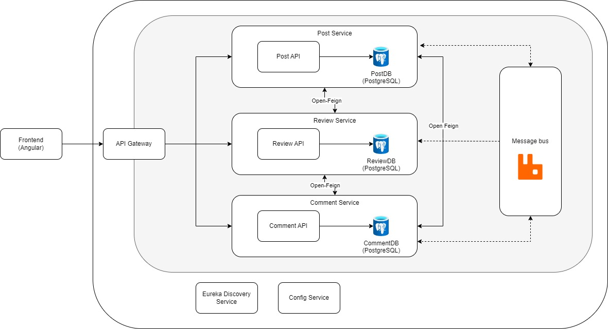

# Architecture

### 1. **Frontend (Angular)**
   - The frontend is developed using Angular and interacts with the backend through the API Gateway. It is the user-facing component of this application.

### 2. **API Gateway**
   - The API Gateway acts as a single entry point for the frontend to communicate with backend services.
   - It routes incoming requests to the appropriate services (Post, Review, or Comment Service).

### 3. **Microservices**
   - **Post Service**
     - Manages the creation, reading, updating, and deletion of posts.
     - Has its own PostgreSQL database (`PostDB`) for storing post-related data.
   - **Review Service**
     - Manages reviews for posts and has its own PostgreSQL database (`ReviewDB`).
   - **Comment Service**
     - Manages comments on posts and has its own PostgreSQL database (`CommentDB`).

   Each of these services is a self-contained microservice with its own database, allowing for independent scaling and development.

### 4. **Communication Between Services**
   - **OpenFeign**: 
        - OpenFeign is a declarative HTTP client for inter-service communication. 
     
   - **Message Bus**
        - The Message Bus (represented by RabbitMQ in this case) enables asynchronous communication between services.
  

### 6. **Eureka Discovery Service**
   - Each service registers with Eureka, allowing other services to dynamically discover each other.

### 7. **Config Service**
   - The Config Service centralizes configuration management for all services.
